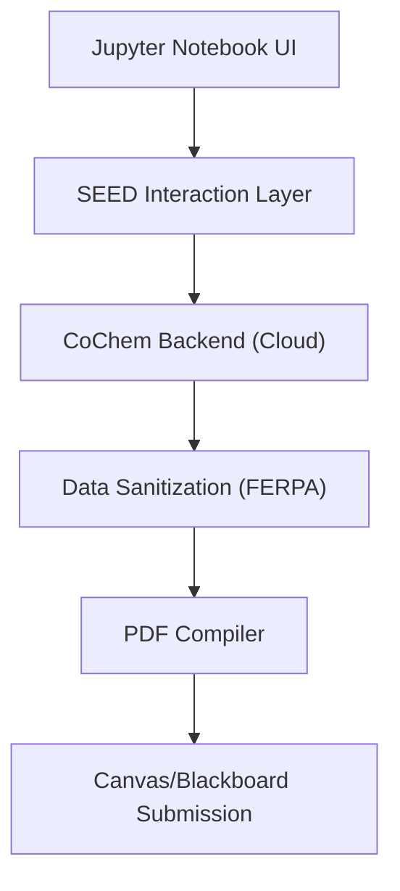

# CoChem-SEED: Student Evaluation & Educational Dashboard

## PI & Metadata
- **PI/Developer:** Dr. Joshua John Klaassen
- **ORCiD:** [0009-0007-1506-4401](https://orcid.org/0009-0007-1506-4401)
- **GitHub Organization:** [ProfJJK-CoChem](https://github.com/ProfJJK-CoChem)
- **CoChem User Manual:** [CoChem_User_Manual.md](https://github.com/ProfJJK-CoChem/CoChem-BASE/blob/main/CoChem_User_Manual.md)
- **Method Matrix:** [Method_Matrix.md](https://github.com/ProfJJK-CoChem/CoChem-BASE/blob/main/Method_Matrix.md)

*Note: CoChem has recently migrated to the Valeev Stack (MPQC, F12) to expose students to state-of-the-art computational workflows and highly accurate explicitly correlated methods [M].*

## What This Repository Does
**CoChem-SEED** acts as a virtual Teaching Assistant (TA), bridging the gap between highly complex computational chemistry and introductory student lab environments. It allows students to execute professional-grade chemistry simulations directly from their web browsers without needing prior programming experience.

Key capabilities include:
- **Socratic Interactions:** Guides students through computational lab exercises with interactive, conceptual questions.
- **FERPA Privacy Guards:** Employs rigorous cryptographic hashing to shield Student IDs. Personal data is 100% [D] scrubbed before writing to disk, ensuring strict privacy compliance [M].
- **Automated PDF Compilation:** Strips away the complex raw Python backend code and compiles a formatted, readable PDF report upon completion, optimized for Canvas or Blackboard upload.

### Data Flow Architecture

## Setup & Installation
For Instructors:
1. Clone the repository: `git clone https://github.com/ProfJJK-CoChem/CoChem-SEED.git`
2. Define the curriculum configurations inside the `seed_curriculum.db`.
3. Provision JupyterHub or GitHub Codespaces environments referencing `requirements.txt`.

For Students:
No installation is required. Simply access the cloud workspace provided by your instructor.

## Getting Started
1. Open the lab workspace URL in your browser.
2. Navigate to the `notebooks/` directory and open your assigned `.ipynb` file.
3. Click inside the first gray cell and press `Shift + Enter` to initialize the TA dashboard.
4. Follow the interactive widgets to complete the assignment. Refer to the [User Manual](https://github.com/ProfJJK-CoChem/CoChem-BASE/blob/main/CoChem_User_Manual.md) if you encounter any environment errors.

---
